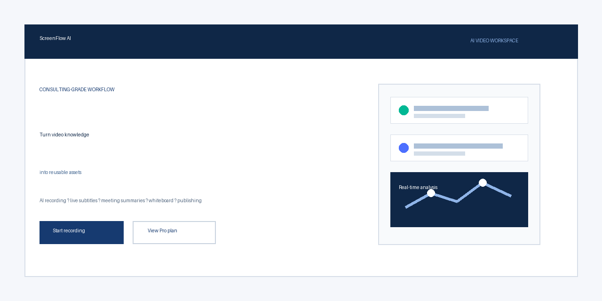
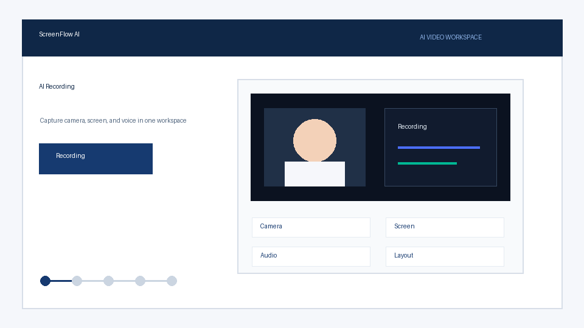

<p align="center">
  
</p>

<h1 align="center">ScreenFlow AI</h1>

<p align="center">
  <strong>AI recording, live subtitles, meeting summaries, whiteboard collaboration, and publishing in one commercial-ready workspace.</strong>
</p>

<p align="center">
  <a href="#english">English</a> ·
  <a href="#中文">中文</a> ·
  <a href="https://www.emai2.cn/meet/">Live Demo</a> ·
  <a href="./CONTRIBUTING.md">Contributing</a> ·
  <a href="./SECURITY.md">Security</a>
</p>

<p align="center">
  
  
  
  
  
  
  
</p>

> If you publish under another GitHub owner, replace `YiMai-AI/screenflow-ai-studio` in the badge URLs with your repository path.

<p align="center">
  
</p>

<p align="center">
  
</p>

---

## English

ScreenFlow AI is an open-source AI video workspace for online education, corporate training, and content creators. It turns fragmented recording, subtitles, summaries, whiteboard interaction, and publishing into a repeatable operating workflow.

### Why It Matters

Most AI recording tools stop at transcription. ScreenFlow AI goes further:

- Capture camera, screen, meeting, subtitles, and whiteboard in one workspace.
- Generate AI co-pilot suggestions, summaries, and structured analysis while recording.
- Export SRT/VTT subtitles and prepare reusable assets for publishing.
- Validate paid intent through a Pro application and review workflow.
- Run WebRTC meetings with mediasoup, VP8-first interop, and bandwidth-aware defaults.

### Product Modules

| Module | What It Does |
| --- | --- |
| AI Recording | Camera + screen recording, layouts, captions, AI co-pilot, analytics, and export |
| Meeting Room | Multi-party video, chat, whiteboard, polls, recording list, and screen sharing |
| AI Co-pilot | Real-time prompts, examples, clarifying questions, and teaching structure |
| Publishing Desk | Cover generation, subtitle export, summary packaging, and platform-ready workflow |
| Pro Applications | Lead capture, application review, status handling, and paid-intent validation |

### Tech Stack

| Layer | Stack |
| --- | --- |
| Frontend | React 19, TypeScript, Vite 6, Tailwind CSS v4 |
| State | Zustand + persist |
| i18n | react-i18next |
| Realtime | Socket.IO |
| Video | WebRTC + mediasoup |
| Backend | Express, Socket.IO, Prisma, SQLite |
| AI | OpenRouter-compatible chat completion API |

### Quick Start

```bash
npm install
cd server && npm install && npx prisma db push && cd ..
```

```bash
cp .env.example .env.local
cp server/.env.example server/.env
```

```bash
cmd /c npm start
```

Default local URLs:

- Frontend: [http://localhost:3000/meet/](http://localhost:3000/meet/)
- Backend: [http://localhost:4000](http://localhost:4000)
- Health check: [http://localhost:4000/api/health](http://localhost:4000/api/health)

Production build:

```bash
npm.cmd run build
cd server && npm.cmd run build
```

### Deployment Notes

For mediasoup/WebRTC deployment, configure:

- `ANNOUNCED_IP`: public server IP for ICE candidates.
- `SFU_RTC_MIN_PORT` / `SFU_RTC_MAX_PORT`: UDP RTP port range.
- `JWT_SECRET`: strong random secret.
- `OPENROUTER_API_KEY`: server-side AI key.
- `CORS_ORIGIN`: production domain.

Do not commit production `.env` files, local databases, TURN credentials, OAuth secrets, or private deployment paths.

### Support

If this project helps you, donations are welcome.

<p>
  
</p>

### License

MIT License. See [LICENSE](./LICENSE).

---

## 中文

ScreenFlow AI 是一个面向在线教学、企业培训和内容创作者的开源 AI 视频工作台。它把录制、字幕、摘要、白板互动、会议协作和发布交付整合成一条可复用的工作流。

### 为什么值得关注

多数 AI 录制工具只停留在“转写”。ScreenFlow AI 进一步把视频内容生产变成完整链路：

- 一个工作台完成摄像头、屏幕、会议、字幕和白板互动。
- 录制过程中实时生成 AI 副驾驶提示、案例建议、追问和结构化分析。
- 支持 SRT/VTT 字幕导出、AI 摘要和可复用交付资产。
- 通过 Pro 申请和审核工作台验证真实付费意愿。
- 基于 mediasoup 的 WebRTC 会议，优先 VP8，默认低带宽配置，适合云服务器部署。

### 产品模块

| 模块 | 能力 |
| --- | --- |
| AI 录课 | 摄像头 + 屏幕录制、布局、字幕、AI 副驾驶、分析和导出 |
| 会议室 | 多人视频、聊天、白板、投票、录制列表和屏幕共享 |
| AI 副驾驶 | 实时提示、案例补充、追问建议和讲解结构优化 |
| 发布工作台 | 封面生成、字幕导出、摘要打包和发布流程准备 |
| Pro 申请 | 线索采集、申请审核、状态管理和付费意愿验证 |

### 技术栈

| 层级 | 技术 |
| --- | --- |
| 前端 | React 19、TypeScript、Vite 6、Tailwind CSS v4 |
| 状态 | Zustand + persist |
| 国际化 | react-i18next |
| 实时通信 | Socket.IO |
| 视频会议 | WebRTC + mediasoup |
| 后端 | Express、Socket.IO、Prisma、SQLite |
| AI 能力 | OpenRouter 兼容 Chat Completion API |

### 快速开始

```bash
npm install
cd server && npm install && npx prisma db push && cd ..
```

```bash
cp .env.example .env.local
cp server/.env.example server/.env
```

```bash
cmd /c npm start
```

默认地址：

- 前端：[http://localhost:3000/meet/](http://localhost:3000/meet/)
- 后端：[http://localhost:4000](http://localhost:4000)
- 健康检查：[http://localhost:4000/api/health](http://localhost:4000/api/health)

生产构建：

```bash
npm.cmd run build
cd server && npm.cmd run build
```

### 部署提示

WebRTC/mediasoup 部署时重点配置：

- `ANNOUNCED_IP`：服务器公网 IP，用于 ICE candidates。
- `SFU_RTC_MIN_PORT` / `SFU_RTC_MAX_PORT`：UDP RTP 端口范围。
- `JWT_SECRET`：强随机密钥。
- `OPENROUTER_API_KEY`：服务端 AI Key。
- `CORS_ORIGIN`：生产域名。

不要提交生产 `.env`、本地数据库、TURN 密码、OAuth Secret、真实服务器 IP 或私有部署路径。

### 支持项目

如果 ScreenFlow AI 对你有帮助，欢迎通过支付宝打赏支持项目维护。

<p>
  
</p>

### 开源协议

本项目使用 MIT License，详见 [LICENSE](./LICENSE)。

---

## Repository Hygiene

- Read [CONTRIBUTING.md](./CONTRIBUTING.md) before opening pull requests.
- Read [SECURITY.md](./SECURITY.md) before reporting vulnerabilities.
- Rotate any real API key that has ever appeared in local `.env*` files.
- Keep `demo.mp4`, local screenshots, and private QR code source files out of git unless intentionally published.
